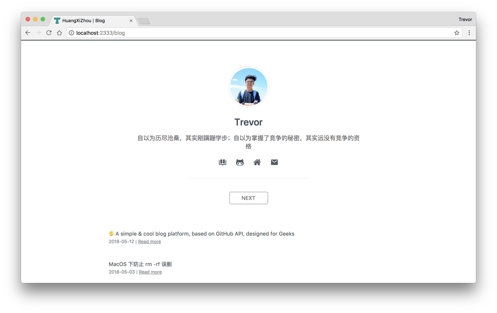

# theme-github-simple

An official theme designed for TB.

<p align="center">
  <a href="https://github.com/TB-blog/theme-github-simple" target="_blank">
    
    <br>
    Source code
  </a>
</p>

## Build Setup

Requires Node.js 8+

```bash
# generate your blog project
tb init [project-name]

# chooese theme-geek-morning
? Chooese a theme you want:
❯ theme-github-simple

# enter [project]
cd [project-name]

# install dependencies
npm install # or yarn

# serve in dev mode, with hot reload at localhost:8080
npm run dev

# build for production
npm run build

# serve in production mode
npm start
```

## Source theme

[Mirror](https://github.com/LoeiFy/Mirror)

## License

[MIT](LICENSE)
